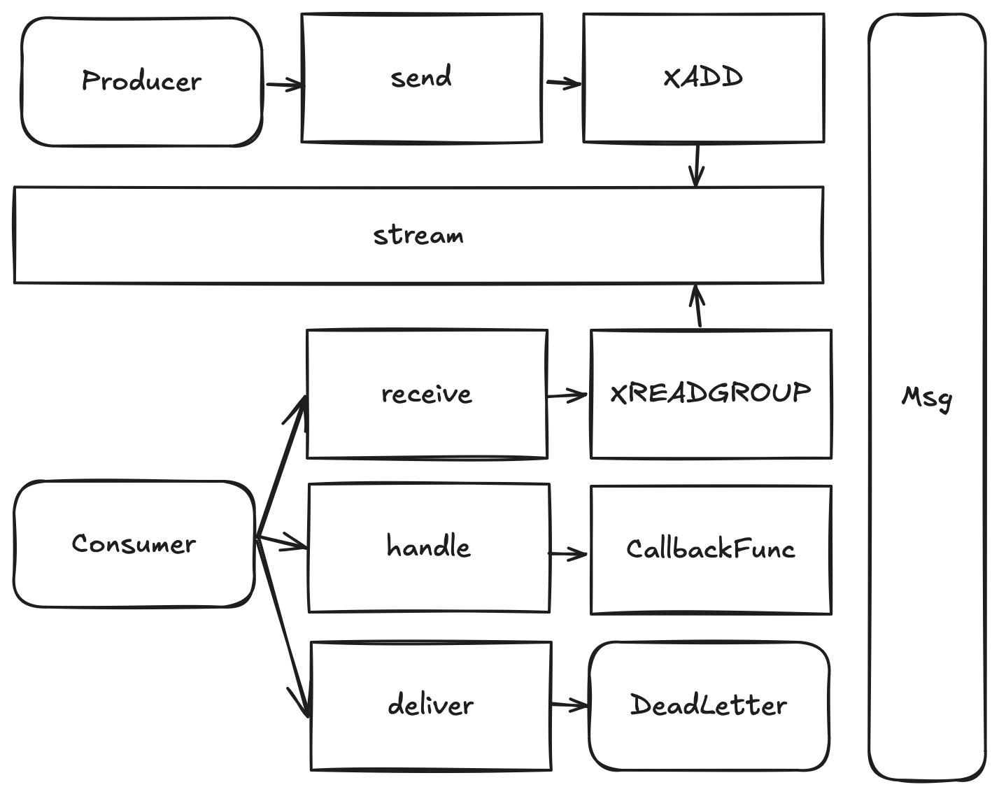

# redis-mq
***
## 介绍
redis-mq是基于redis5.0新加入的数据结构stream实现的消息队列
+ 基于go-redis封装了redis客户端，以及XADD、XREADGROUP和XACK方法
+ 实现了producer和consumer基于消息队列的消息传递架构
***
## 开始
1.创建Topic
```
localhost:6379> XADD topic * key val
"1724556216679-0"
```
2.创建消费者组
```
localhost:6379> XGROUP CREATE topic group 0-0
"OK"
```
3.安装go-redis
```
go get github.com/redis/go-redis/v9
```
***
## 架构


***
## 联系
`lirity1024@outlook.com`